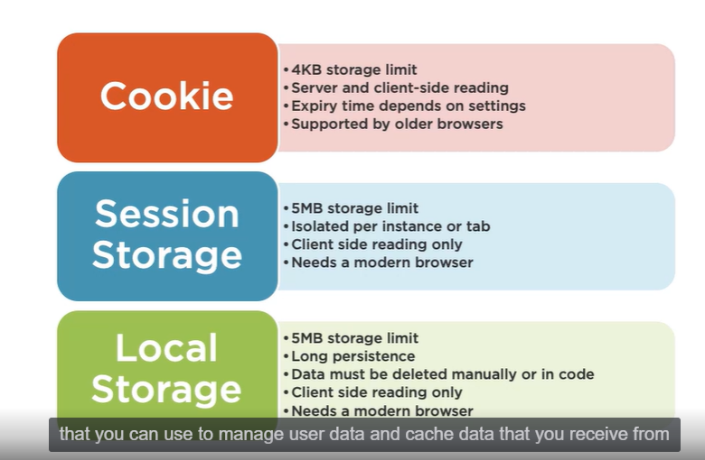

Cookies are deleted when the browser instance is closed.

Local and session storage differ from each other only in lifetime and scope.

## Session Storage

Session storage is isolated to a particular domain name. Data stored for Domain A cant be accessed by Domain B. 

The storage container is not only per origin but also its per browser instance. This means that session storage container is also tied to a particular browser window or tab.

If you were to open the same domain in 2 separate tabs/windows, then they both would have their own session storage instance. This means you can run the same app in multiple tabs or windows without 1 browser instance interfering with another. 

Now because the storage is tied to the browser instance, it is destroyed once the browser instance is closed. 
Session storage data is never sent along with the web request to the server unlike cookies. Since it is tied to both the browser instance and the domain, it is more secure than cookies.

## Local Storage

In local storage if the data is stored for a domain, it is available across all browser tabs/windows opening that domain and also persists after the browser instance is closed. So if you open a new tab or window and open the same domai, the local storage data will persist. Exception is with incognito window. Local storage data is not available when the same domain is opened in incognito tab.

Data persists till the user manually clears their local storage.

### Issues with Storage API functions

Dont store sensitive data --vulnerable to XSS attacks
Functions are synchronous
No access to web workers

### Refreshing the data in the storage

You can fetch the data for the first time and store the data and the time it was fetched in the local storage as
2 seperate keys.

You need to then keep polling to check if the difference between the current date and the last fetched date has
a certain value you are expecting.
If the difference is more, make the API call again and update the 2 keys in the local storage.
If the difference is less, dont do anything.